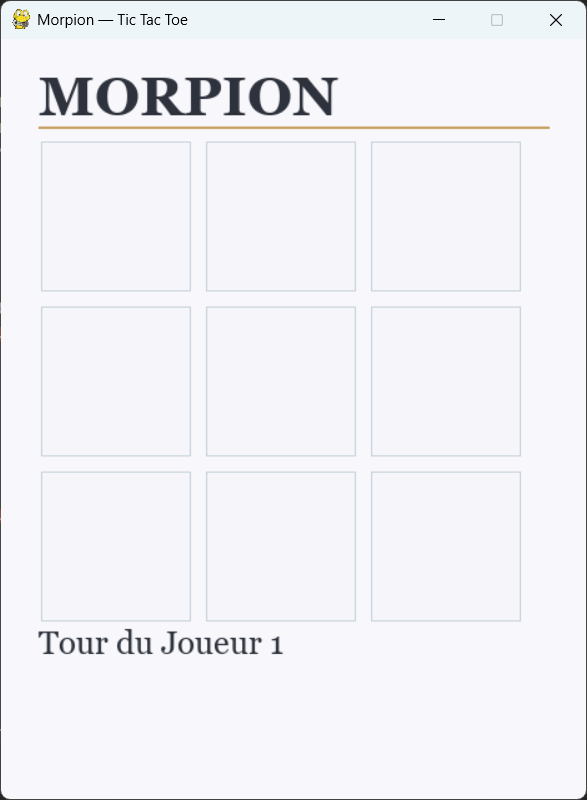
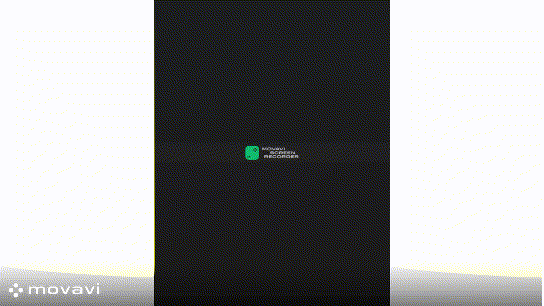

  # 🎮 Morpion (Tic-Tac-Toe) — Python

Un jeu de Morpion développé en Python avec une interface Pygame simple et moderne.

## 🧠 Description

Ce projet implémente une version locale du Morpion (Tic-Tac-Toe) pour deux joueurs sur PC.
Le jeu propose une grille 3x3, une détection automatique des victoires et des égalités, ainsi que des actions pour rejouer ou quitter.

## 🚀 Fonctionnalités

- Mode 2 joueurs local
- Interface graphique Pygame
- Détection automatique du gagnant
- Détection de l'égalité
- Boutons `Rejouer` et `Quitter`
- Logique de jeu simple et modulable

## 📦 Installation

1. Ouvrez un terminal dans le dossier `src`
2. Installez les dépendances :

```bash
pip install -r requirements.txt
```

> Si vous utilisez un environnement virtuel, activez-le d'abord avant l'installation.

## ▶️ Lancer le jeu

Dans le dossier `src`, exécutez :

```bash
python Morpion.py
```

## �️ Aperçu





## �📁 Structure du projet

- `Morpion.py` — point d'entrée du jeu et boucle principale
- `engine/Grille.py` — gestion de la grille, affichage des cases et détection des clics
- `engine/Player.py` — gestion des joueurs, du tour en cours et de la validation des victoires
- `engine/ButtonManage.py` — gestion des boutons `Rejouer` et `Quitter`
- `requirements.txt` — dépendances Python requises

## 💡 Améliorations possibles

- Ajouter un mode joueur contre IA
- Proposer plusieurs thèmes de couleurs
- Enregistrer et afficher le score des joueurs
- Optimiser la gestion des égalités
